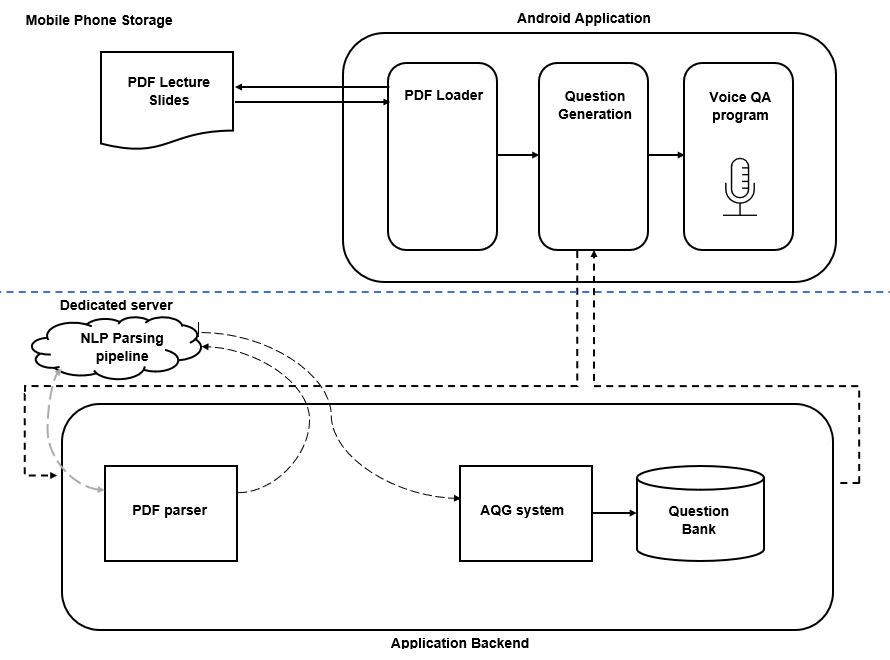

# Intelligent Voice based app for Revision using Automatic Question Generation #

The project consists of an Android app that uses Automatic Question Generation (AQG) techniques to aid its users with revision. Automatic Question Generation is a growing field of research that determines methods to construct questions from text, concepts maps, etc. This novel system is tailored to work effectively with lecture slides in particular, analysing the material and using complex linguistic rules and Natural Language Processing to form questions out of bullet pointed text. Ideally users would then be able to communicate with the app through voice based conversation and receive feedback on their answers, however this repository contains only the Android side, which demonstrates how the user can answer questions using their voice as well as upload documents from their device into the AQG system. The working Automatic Question Generation was developed seperately.

### Examples of lecture slides and the resulting questions generated ###

Questions were produced at a grammatical coherency rate of up to 75%, with the percentage rising as the proportion of full sentences within the educational material increased.

Questions Generated:

The Android app is a prototype demonstrating how users can be asked questions generated by the AQG methods. Users can answer using their voice which is then analysed to determine their answer's correctness, which is relayed back to the user. There are many opportunities for advancing the capabilites of the application, from user scoring to time-based testing.

[Download the android app here (requires permission to download applications from the internet to be set to allow on your device)] (https://drive.google.com/file/d/1wbWUuWVh60SvT9cQZEwZPfWvrpfj3eh5/view?usp=sharing)

The project was written in Java and Android development languages. In order to integrate the Automatic Question Generation system to the app a dedicated server must be set up in order to run a Natural Language Processing pipeline using jar files from Stanford's CoreNLP. This takes the text from the lecture slides and applies syntactic and semantic tags in order for the Automatic Question Generation system to identify how to convert the sentences into questions. In this repository this method is implemented manually using the Stanford CoreNLP libraries. This project was part of my undergraduate dissertation.

For more information please email a.macheny@outlook.com

Adia-May Macheny

